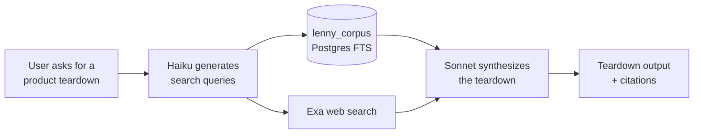
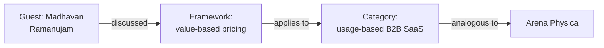
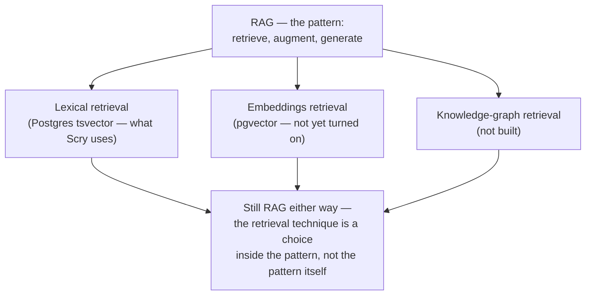
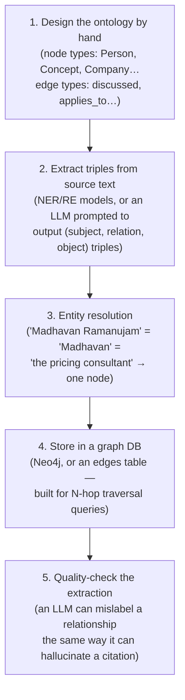
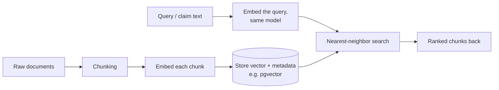

# Scry — Learning Log

A running list of topics, tools, and concepts to explore in more depth.
Triggered during build sessions with \learning — revisited when time allows.

---

## 1. SQL — The Database Setup Script
**Context:** Used to create the `teardowns` and `messages` tables in Supabase.
**Topics to cover:**
- What each clause means: `create table`, `primary key`, `references`, `on delete cascade`
- Data types used: `uuid`, `text`, `jsonb`, `timestamptz`
- What `check` constraints do (e.g. `check (mode in ('generate', 'critique'))`)
- What `default gen_random_uuid()` means and why we use UUIDs instead of regular IDs
- Row Level Security (RLS): what it is, why it matters, how the policies work
- What `auth.uid()` is and how Supabase uses it to identify the current user
- The `vector` extension: what it is, why we enabled it, how it powers the RAG pipeline later

---

## 2. PATH — Mac Terminal Environment Variable
**Context:** Came up when installing Homebrew — needed to add Homebrew to PATH so the terminal could find the `brew` command.
**Topics to cover:**
- What PATH is and how the Mac uses it to find programs
- The difference between `.zprofile` and `.zshrc`
- What `eval` does in a shell command
- How environment variables work generally

---

## 3. npm — Node Package Manager
**Context:** Used to install project dependencies (`npm install`) and run the app locally (`npm run dev`).
**Topics to cover:**
- What npm is and how it relates to Node.js
- What `package.json` is and what it contains
- What `package-lock.json` is and why it changes on install
- What `node_modules` is and why it's never committed to GitHub
- Common npm commands: install, run, audit

---

## 4. pgvector — Vector Database Extension
**Context:** Enabled in Supabase via `create extension if not exists vector` — will power the RAG pipeline in Phase 2.
**Topics to cover:**
- What a vector is in the context of AI/ML
- How text gets converted into vectors (embeddings)
- What semantic similarity means and why it's more powerful than keyword search
- How pgvector fits into the RAG pipeline for Scry
- Why we're using pgvector inside Supabase instead of a separate vector DB like Pinecone

---

## 5. Git & GitHub — Version Control Basics
**Context:** Cloning the repo, `.gitignore`, the orange M (modified) indicator in Cursor.
**Topics to cover:**
- What git is and what version control means
- The basic git workflow: edit → stage → commit → push
- What `.gitignore` does and why some files should never be committed
- What the M, A, D indicators mean in Cursor's file tree
- Branches: what they are and when we'll need them

**Lessons learned in the build:**
- `git pull --no-rebase origin main` is the safest default for solo projects
- Remote can get ahead of local when editing files directly on GitHub (e.g. README)
- Always check `git log HEAD..origin/main --oneline` before panicking about rejected pushes
- `git show <commit-hash>:src/path/to/file.tsx` shows a file at a specific commit

---

## 6. Environment Variables & `.env.local`
**Context:** Created `.env.local` to store Supabase URL and API key securely.
**Topics to cover:**
- What environment variables are and why we use them
- Why secrets should never be hardcoded in source code
- The difference between `.env`, `.env.local`, `.env.production`
- What `VITE_` prefix means and why it's required for this project
- Why `.env.local` must be in `.gitignore`

**Lessons learned:**
- Supabase secrets set via `supabase secrets set KEY=value` in terminal
- Frontend vars must be prefixed with `VITE_` to be accessible in React
- Never commit API keys — they belong in .env or Supabase secrets

---

## 7. React Fundamentals — How Scry Is Built
**Context:** Learning session covering the structure, logic, and language of the frontend codebase.
**Status:** Covered at a high level — good foundation established.

### TSX
- TypeScript + JSX — lets you write HTML-like syntax directly inside JavaScript/TypeScript files
- TS adds types to JS (catches bugs before they happen); JSX adds HTML syntax; TSX = both together
- React converts TSX to real HTML when the app runs in the browser

### The app tree mental model
- React apps are trees of components — big frames made of smaller frames (like Figma)
- `App.tsx` is the root; it defines routes; routes render pages; pages use components; components use smaller components
- Reference: `docs/scry-app-tree.js`

---

## 8. RAG, Embeddings & Knowledge Graphs — Retrieval Techniques
**Context:** Came up 2026-09-04 while deciding whether Scry's keyword-based corpus search is good enough for the eval, or whether the retrieval method itself needs to change before the eval's results can be trusted.

### RAG is the pattern, not a technique
Retrieval-Augmented Generation: instead of only using what the model memorized during training, fetch relevant material at request time and feed it into the prompt, so generation is "augmented" by retrieval. Three stages — **retrieve** (find relevant content), **augment** (put it in the prompt), **generate** (the model writes using that context). RAG doesn't specify *how* you retrieve — that's a separate, swappable choice. Scry's actual pipeline:

### Three ways to do the "retrieve" step

**Lexical / keyword search — what Scry uses today.** Postgres full-text search (`tsvector`) matches literal words and word-stems. Query "usage-based pricing," it finds documents containing those words. Fast, cheap, exact matches are precise. Failure mode: "usage-based pricing" and "consumption pricing model" mean nearly the same thing but share almost no literal words — lexical search sees them as unrelated. This is the concrete mechanism behind "we might be missing analogous material that exists in the archive but doesn't share vocabulary with the query."

**Embeddings / semantic search.** An embedding model converts text into a vector — a long list of numbers (often 768–1536 of them) — positioned so that texts with *similar meaning* land near each other in that space, regardless of shared vocabulary. "Usage-based pricing" and "consumption pricing model" end up close together because the embedding model learned during its own training that these mean similar things. At query time, embed the query and search for the nearest vectors ("nearest-neighbor search"). `pgvector` is the Postgres extension that stores these vectors and does that search inside the same database — already enabled on Scry's Supabase project, schema-ready, unused. Real limitation: embedding-similarity measures *topical* closeness, not *strategic relevance* — a chunk about Slack's pricing and a chunk about Notion's pricing sit close together just because both are "SaaS pricing" text, whether or not either is the *right* analogy for the product actually being analyzed.

**Knowledge graph.** Instead of points in continuous space, represent content as explicit nodes (a guest, a framework, a company, a concept) connected by labeled, typed edges. Querying becomes graph traversal — walk outward from the inquiry through real relationships, possibly several hops away, and unlike embeddings you can show the *path*, i.e. explain *why* something is relevant:

The cost: building the graph needs an extraction step (something reads every transcript/newsletter and pulls out entities + relationships — itself usually an LLM task, with its own error surface, just moved earlier in the pipeline instead of at generation time), plus designing an ontology (what node types and relationship types exist) before writing any query code. Meaningfully bigger build than flipping on `pgvector`.

| | Matches on | Explains "why relevant"? | Build cost | Failure mode |
|---|---|---|---|---|
| Lexical (current) | shared words | no | already built | misses paraphrases/analogies |
| Embeddings | shared meaning | no | small (pgvector's ready) | similarity ≠ relevance |
| Knowledge graph | explicit relationships | yes | large (extraction + ontology) | extraction step can mislabel/hallucinate relationships |

### The sequencing decision (already made, before this eval)
`docs/BACKLOG.md` already said, before this eval started: *"Semantic retrieval... fast-follow to the FTS-only search, once FTS quality is judged on real teardowns."* Not an oversight — a deliberate "ship cheap, measure it for real, then decide" order. This eval is that judgment moment. Don't build embeddings or a knowledge graph speculatively; let the citation-verification and judge results show whether retrieval recall (missing real content) or something else (e.g. generation-time fabrication discipline) is the actual bottleneck first.

---

## 9. LLM-as-Judge Evaluation — Bias, Groundedness & Reliability
**Context:** Came up 2026-09-04 while building `scripts/eval/run-judgments.mjs` and `judge-prompts.mjs`. Using an LLM to score and compare two AI-generated outputs introduces its own failure modes, separate from whatever's wrong with the outputs being judged — an eval can be unreliable even when the thing it's evaluating is fine.

| Term | What it means | How Scry's eval handles it |
|---|---|---|
| **Position bias** (order effect) | Judge models tend to systematically favor whichever output is shown first (or second), independent of actual quality — the LLM-judge-research version of a survey's primacy effect. | **Position swapping**: every comparison runs twice, swapping which real arm is labeled "A." A verdict only counts if the *same* arm wins both times; if the winner flips depending purely on label order, it's recorded as a `tie` instead of a real result. See `orchestration-design.md` §4.1. |
| **Self-preference bias** (self-enhancement bias) | A model tends to rate outputs from its own family more favorably, because it implicitly uses its own generation habits as the template for "good." | Judge with two different model families (Claude + Gemini), not one model judging everything. **Known residual gap**: the Claude judge backend uses the same model (`claude-sonnet-4-5`) that generated the `claude_vanilla`/`claude_web` arms — so a Claude-only verdict on those comparisons should be read as provisional until Gemini's independent verdict exists for the same pair. |
| **Verbosity / length bias** | Judges (like people) tend to rate longer answers as more thorough even when the extra length is padding or restatement, not more substance. | An explicit `LENGTH_BIAS_WARNING` in every comparison prompt, telling the judge a shorter answer that makes its point once shouldn't lose to a longer one restating the same point three times. |
| **Formatting / style bias** | Heavy bullets/headers/bold read as "more organized" even when they're decorating the same amount of substance as plain prose. | An explicit `FORMATTING_BIAS_WARNING` — the arms differ systematically in formatting for reasons unrelated to quality (Scry produces structured sections, the baselines produce prose). |
| **Groundedness / faithfulness** | Whether a claim is actually supported by real evidence, vs. invented. The RAG-eval field's term for "does it hallucinate." | The whole citation-verification layer, plus (as of 2026-09-04) the `grounded_insight_value` dimension's `classifyGroundedness()` check. |
| **Hallucination vs. fabrication vs. misattribution** | Loosely used as synonyms, but scored as three distinct things here. | *Hallucination* = the general term. *Fabricated* = no real source found anywhere for the claim. *Misattributed* = the content is real, credited to the wrong speaker/source (guest-to-host is a named special case). *Verified-verbatim*/*verified-paraphrase* = the two genuinely-grounded tiers, differing only in exact wording vs. matched substance. |
| **Idempotency** | Running the same operation twice produces the same result as running it once. | Re-running the judging script over already-judged data skips rather than re-calls (paid, non-deterministic) judge APIs or overwrites existing verdicts — `alreadyJudged()` in `run-judgments.mjs`. |
| **Claim equivalence / deduplication** | Before scoring "uniqueness," you need to know whether two differently-worded claims are actually the same point. | `claimEquivalencePrompt` — a dedicated judge call, separate from extraction and from scoring, so an arm can't "win" on novelty just by paraphrasing something both sides already said. |
| **Ground truth** | The actual real facts a claim is checked against, as opposed to an opinion. | For factual claims: the real archive content, or a live web check. There is no ground truth for "is this reasoning good" — which is exactly why `framework_application`/`competitive_positioning`/`coherence_actionability` stay softer than the citation layer no matter how the prompt is worded. |
| **Inter-rater agreement** | How often two independent judges reach the same verdict on the same comparison. | Not yet computed — worth adding once Gemini is producing real results: heavy Claude/Gemini disagreement on a dimension would itself signal that dimension is less reliable than assumed, independent of which arm "wins." |

### Why `grounded_insight_value` isn't called `insight_novelty` anymore
It started as pure novelty scoring: extract claims, dedupe overlapping ones across the two outputs, rate what's left. The original scoring asked the judge to rate "validity" as *"how likely is this claim to be actually true, based on what a knowledgeable practitioner would believe"* — which is exactly the shape of the problem it was supposed to catch. A well-written hallucination is, by construction, a claim a knowledgeable practitioner would find believable; that's what makes it well-written. Judged plausibility can't distinguish a true claim from a confident, plausible, false one.

As of 2026-09-04, validity is no longer judge-guessed. `classifyGroundedness()` checks each unique claim against the real archive first (reusing the same lookup citation-verification uses), then a live web fact-check if the archive has nothing. Only "usefulness" — genuinely a judgment call even once truth is established — is left to the judge. An ungrounded-but-confident claim is actively penalized in the score (not just excluded), per the explicit call that a nice-sounding hallucination is worse than no claim at all. "Novelty" described only the dedup step; the dimension as a whole now measures something closer to *verified, unique, useful* — hence the rename.

---

## 10. Is Scry's Retrieval Actually RAG Without Embeddings?
**Context:** 2026-09-06, a direct question after entry 8 already covered lexical search, embeddings, and knowledge graphs as three retrieval techniques — does picking the lexical one disqualify Scry from being "a RAG system" at all?

**Yes, it's still RAG — this is a common misconception worth naming precisely.** "RAG" (Retrieval-Augmented Generation) is the *pattern*: retrieve relevant content, put it in the prompt, generate using that context. It is not a specific retrieval technique. The "R" step can be implemented as keyword/lexical search, embeddings/vector similarity, a knowledge graph, or some hybrid — none of those is a requirement baked into the term.

**Where the confusion comes from:** the 2020 paper that coined "RAG" (Lewis et al.) happened to use dense embeddings for its retrieval step, and that pairing became the default association in a lot of people's minds. Industry usage broadened well past that specific implementation choice since then — production systems built on BM25/full-text search, long before "RAG" was a common term, get retroactively (and currently) described as RAG systems too. When the distinction matters, people say "lexical RAG" or "keyword RAG" versus "vector RAG" specifically *because* the retrieval technique varies independently of whether something counts as RAG at all.

**Scry's own pipeline, mapped onto this:** Haiku generates search queries → Postgres full-text search over `lenny_corpus` **and** Exa web search run → Sonnet synthesizes using whatever came back. That's retrieval feeding augmented generation — the RAG pattern — implemented with lexical retrieval (plus a second, separate retrieval source, Exa, which *does* use real embeddings-based semantic search under the hood — see entry 8's note on the quality asymmetry this creates between Scry's two grounding sources). Turning on `pgvector` later (entry 8) would change *which* retrieval technique sits inside the pattern; it would not be the moment Scry "becomes" a RAG system — it already is one.

---

## 11. Embeddings vs. Knowledge Graphs — the Mechanisms, Not Just the Definitions
**Context:** 2026-09-06, a repeated question across several sessions — entries 8 and 10 covered *what* these two retrieval techniques are and *when* you'd reach for each, but not the actual mechanics: how does an embedding model learn what counts as "similar," what precisely is a knowledge-graph edge, and how does either one actually get built.

### Embeddings — how the model learns what's similar

Two training stages stack together. Neither involves anyone hand-labeling "these two phrases are synonyms."

**Stage 1 — pretraining already builds in rough meaning, for free.** An embedding model starts as (or sits on top of) a transformer trained the same way an LLM is: predict the next word, across a huge corpus. To get good at that job, the model is forced to implicitly learn that "happy" and "glad" behave near-interchangeably in context, that "usage-based" and "consumption-based" pricing get discussed with the same surrounding vocabulary (metered, per-unit, scale, billing). Nobody labels any of this — it falls out of the statistics of predicting what word comes next, at scale.

**Stage 2 — contrastive training sharpens that into a real similarity space.** Pretraining gives good *per-word* representations but not whole-passage similarity. So there's a second pass: take pairs of text known or assumed to be related (a question and its right answer, two paraphrases, a title and a passage from inside it) — **positive pairs**. Mix in random unrelated text — **negative pairs**. Train the model so positive-pair vectors get pulled close together (cosine similarity up) and negative-pair vectors get pushed apart. Over millions of these pairs (mined automatically from link structure, click logs, QA and paraphrase datasets), the model learns a general similarity space calibrated by contrast, not by rule.

The result is a vector — a list of numbers — with **no interpretable meaning attached to any single dimension**. You can measure distance between two vectors and get a similarity score. You cannot point at *why* they're close, the way you can point at a labeled fact in a graph.

### Knowledge graphs — what an edge is, and the real build pipeline

An edge is not a number. It's an explicit, typed, asserted fact: **source node —relationship type→ target node**. *Madhavan Ramanujam —discussed→ value-based pricing* is a literal, readable sentence, not a distance measurement — you could read the whole graph out loud as a list of facts.

Walking through the steps: (1) nothing is learned automatically here — a human decides up front what kinds of nodes exist and what relationships are allowed between which kinds; get this wrong and the graph is either too sparse or too tangled to query. (2) something has to read the raw source material and produce triples matching that ontology — historically dedicated NER/RE models, in practice today often an LLM prompted directly to emit structured triples from a passage, the same shape as this codebase's citation-verification work, generalized. (3) the same real entity gets referred to differently across sources, and unresolved duplicates fragment the graph into disconnected islands that traversal queries silently miss. (4) the triples land in something built for "find everything connected to X within N hops," not a table optimized for row lookups. (5) LLM-based extraction needs the same verification discipline already built into this eval — it can invent a relationship exactly the way it can invent a citation.

### Step 1, expanded — must the ontology be hand-designed?
**Context:** 2026-09-06, following directly from the pipeline diagram above — what "ontology" actually means, precisely, and whether step 1 has to be fully manual.

**Ontology, precisely:** the schema for the graph — allowed node types (Person, Company, Framework, Concept, Episode) and allowed relationship types (discussed, applies_to, works_at, is_a), plus which relationship types can connect which node types (`discussed` makes sense Person → Concept, not Company → Company). Same relationship a database schema has to its rows: the ontology is the table/column definitions; the actual graph is the data sitting in it.

Three real options, not just "manual or not":

- **Fully manual** — domain experts explicitly define the schema by hand. The classic approach for production knowledge graphs, especially where precision matters. High quality, slow, requires real domain judgment.
- **Fully automated ("ontology learning")** — statistical/NLP methods, or an LLM, propose candidate types by noticing recurring patterns in a corpus. Fast, but tends to produce messy results left unsupervised — e.g. separate types for "Founder," "CEO," and "Co-founder" where a human would just use one `Person` node with a role attribute. Automated methods are good at proposing candidates, not at judging what's actually useful for the graph's purpose.
- **Semi-automated — the realistic middle ground and what's actually common in practice:** an LLM scans a representative sample of the corpus and drafts candidate node/edge types, a human reviews and prunes before extraction runs at scale. Same shape as the rest of this eval — model proposes, a verification pass decides what survives — one step earlier than usual, applied to designing the schema instead of checking a citation.

Two more things worth knowing: published, reusable ontologies exist (schema.org's vocabulary, Wikidata's property system, domain-specific ones) — it's common to extend or restrict one of those rather than invent a vocabulary from scratch. And ontology design is rarely a one-time decision regardless of approach — it typically gets revised as real extracted data surfaces cases the original schema didn't anticipate.

### The contrast to hold onto

Embeddings are *learned automatically* from raw text via contrastive training and give you continuous, uninterpretable "these are near each other" — no reason attached. Knowledge graphs are *manually designed* (the ontology) plus *populated* by an extraction process, and give you discrete, labeled, human-readable facts you can trace and explain. That's the entire reason a knowledge graph can answer "why is this relevant" and an embedding search can only answer "this is close."

---

## 12. Deciding on Semantic Search for Real, and How Embedding Pipelines Actually Get Built
**Context:** 2026-09-06/07, the decision that closed out a multi-day investigation — plain word-overlap matching was proven (not assumed) to have a real ceiling in `archive-lookup.mjs`: a genuinely correct match scored 0.43, a wrong one scored 0.538, and no threshold could separate them. TF-IDF weighting (entry 11 doesn't cover this — see the reasoning below) was considered and set aside in favor of embeddings.

### Why embeddings won over TF-IDF weighting specifically
TF-IDF (term frequency × inverse document frequency — weight a word by how rare it is across the whole corpus, so "Duolingo" counts far more than "growth") fixes the *generic-overlap* failure mode: a wrong document that happens to share a lot of common vocabulary. It does **not** fix the *paraphrase* failure mode: "grew through referrals" and "expanded via word-of-mouth" share almost zero literal words, rare or common, so weighting words differently doesn't help when there's nothing to weight in the first place. Since paraphrase mismatches are plausibly as common as the generic-overlap case actually found, TF-IDF risked being a detour that gets rebuilt past rather than a real fix. Embeddings solve both failure modes with one mechanism, because they compare *meaning*, not word identity.

Other real factors in the decision, not just the technical one: the corpus is small (683 rows — a few cents and minutes to embed once, so the usual "big expensive lift" framing for embeddings doesn't apply at this scale); `pgvector` is already provisioned in the schema, unused — this is turning on existing infrastructure, not building new; and Exa's web layer (the other half of Scry's retrieval) already does real semantic search, so the archive — the actual proprietary differentiator — was the one running on the weaker method.

### The general embedding-pipeline process

1. **Chunking** — split documents into pieces small enough to represent one coherent idea. Necessary because embedding an entire long document into one vector would blur many topics into a diluted average, losing the ability to find one specific passage inside a wide-ranging document.
2. **Embedding generation** — each chunk becomes a vector via an embedding model; a one-time batch job over the whole corpus.
3. **Storage** — vectors stored alongside metadata (source document, position, speaker if known) in a vector-capable store.
4. **Query-time retrieval** — the query (or, here, the claim being verified) gets embedded with the *same* model, then nearest-neighbor search (cosine similarity) finds the closest chunks — comparing meaning, not counting shared words.
5. **Usually hybrid, not a replacement** — lexical search still catches exact phrases and proper nouns embeddings sometimes miss; most real systems run both and combine results rather than discarding full-text search entirely.

### Applied to Lenny's corpus specifically — podcasts and newsletters chunk very differently

**Newsletters** (`02-newsletters/*.md`) — prose, single-author, already structured with section headers. The easy case: chunk by paragraph or by Lenny's own H2/H3 breaks. The natural semantic unit already matches the document's own structure.

**Podcasts** (`03-podcasts/*.md`) — the harder, more interesting case. Turn-taking transcripts with speaker tags (`**Katie Dill** (01:28:22):`), often 15,000+ words, where one real idea spans several speaker turns — a leading question, an answer, a follow-up. A naive fixed-length chunker ignores this and can cut a chunk mid-sentence or split a question from its answer. The right approach is **speaker-turn-aware chunking**: group a coherent block of consecutive turns (a question plus its full answer, or a few turns on one sub-topic) into one chunk, respecting the transcript's real structure instead of blindly slicing by character count.

**The structural win this creates, beyond better matching:** if each chunk stores its actual speaker as real metadata *at chunking time* — not inferred later — this doesn't just improve retrieval quality, it eliminates the entire speaker-misattribution bug class from entries 9/11's investigation. The current `nearestPrecedingSpeaker()` has to guess who said something *after the fact*, scanning backward from wherever a lexical match happened to land — that's the exact mechanism behind the Katie Dill misattribution bug (confirmed and fixed once, but structurally fragile). If retrieval instead returns "this chunk, tagged Katie Dill, guest" directly from metadata attached during chunking, there's no after-the-fact guessing left to do at all. That's a structural fix, not another heuristic patch.

**Practical note for the eventual build, not yet decided:** an embedding model is needed to turn text into vectors. Gemini's own embedding API is the path of least friction here, since billing is already live on that account for this project — worth knowing, not a commitment.