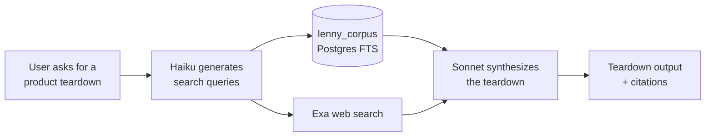

# Scry — Learning Log

A running list of topics, tools, and concepts to explore in more depth.
Triggered during build sessions with \learning — revisited when time allows.

---

## 1. SQL — The Database Setup Script
**Context:** Used to create the `teardowns` and `messages` tables in Supabase.
**Topics to cover:**
- What each clause means: `create table`, `primary key`, `references`, `on delete cascade`
- Data types used: `uuid`, `text`, `jsonb`, `timestamptz`
- What `check` constraints do (e.g. `check (mode in ('generate', 'critique'))`)
- What `default gen_random_uuid()` means and why we use UUIDs instead of regular IDs
- Row Level Security (RLS): what it is, why it matters, how the policies work
- What `auth.uid()` is and how Supabase uses it to identify the current user
- The `vector` extension: what it is, why we enabled it, how it powers the RAG pipeline later

---

## 2. PATH — Mac Terminal Environment Variable
**Context:** Came up when installing Homebrew — needed to add Homebrew to PATH so the terminal could find the `brew` command.
**Topics to cover:**
- What PATH is and how the Mac uses it to find programs
- The difference between `.zprofile` and `.zshrc`
- What `eval` does in a shell command
- How environment variables work generally

---

## 3. npm — Node Package Manager
**Context:** Used to install project dependencies (`npm install`) and run the app locally (`npm run dev`).
**Topics to cover:**
- What npm is and how it relates to Node.js
- What `package.json` is and what it contains
- What `package-lock.json` is and why it changes on install
- What `node_modules` is and why it's never committed to GitHub
- Common npm commands: install, run, audit

---

## 4. pgvector — Vector Database Extension
**Context:** Enabled in Supabase via `create extension if not exists vector` — will power the RAG pipeline in Phase 2.
**Topics to cover:**
- What a vector is in the context of AI/ML
- How text gets converted into vectors (embeddings)
- What semantic similarity means and why it's more powerful than keyword search
- How pgvector fits into the RAG pipeline for Scry
- Why we're using pgvector inside Supabase instead of a separate vector DB like Pinecone

---

## 5. Git & GitHub — Version Control Basics
**Context:** Cloning the repo, `.gitignore`, the orange M (modified) indicator in Cursor.
**Topics to cover:**
- What git is and what version control means
- The basic git workflow: edit → stage → commit → push
- What `.gitignore` does and why some files should never be committed
- What the M, A, D indicators mean in Cursor's file tree
- Branches: what they are and when we'll need them

**Lessons learned in the build:**
- `git pull --no-rebase origin main` is the safest default for solo projects
- Remote can get ahead of local when editing files directly on GitHub (e.g. README)
- Always check `git log HEAD..origin/main --oneline` before panicking about rejected pushes
- `git show <commit-hash>:src/path/to/file.tsx` shows a file at a specific commit

---

## 6. Environment Variables & `.env.local`
**Context:** Created `.env.local` to store Supabase URL and API key securely.
**Topics to cover:**
- What environment variables are and why we use them
- Why secrets should never be hardcoded in source code
- The difference between `.env`, `.env.local`, `.env.production`
- What `VITE_` prefix means and why it's required for this project
- Why `.env.local` must be in `.gitignore`

**Lessons learned:**
- Supabase secrets set via `supabase secrets set KEY=value` in terminal
- Frontend vars must be prefixed with `VITE_` to be accessible in React
- Never commit API keys — they belong in .env or Supabase secrets

---

## 7. React Fundamentals — How Scry Is Built
**Context:** Learning session covering the structure, logic, and language of the frontend codebase.
**Status:** Covered at a high level — good foundation established.

### TSX
- TypeScript + JSX — lets you write HTML-like syntax directly inside JavaScript/TypeScript files
- TS adds types to JS (catches bugs before they happen); JSX adds HTML syntax; TSX = both together
- React converts TSX to real HTML when the app runs in the browser

### The app tree mental model
- React apps are trees of components — big frames made of smaller frames (like Figma)
- `App.tsx` is the root; it defines routes; routes render pages; pages use components; components use smaller components
- Reference: `docs/scry-app-tree.js`

---

## 8. RAG, Embeddings & Knowledge Graphs — Retrieval Techniques
**Context:** Came up 2026-09-04 while deciding whether Scry's keyword-based corpus search is good enough for the eval, or whether the retrieval method itself needs to change before the eval's results can be trusted.

### RAG is the pattern, not a technique
Retrieval-Augmented Generation: instead of only using what the model memorized during training, fetch relevant material at request time and feed it into the prompt, so generation is "augmented" by retrieval. Three stages — **retrieve** (find relevant content), **augment** (put it in the prompt), **generate** (the model writes using that context). RAG doesn't specify *how* you retrieve — that's a separate, swappable choice. Scry's actual pipeline:

### Three ways to do the "retrieve" step

**Lexical / keyword search — what Scry uses today.** Postgres full-text search (`tsvector`) matches literal words and word-stems. Query "usage-based pricing," it finds documents containing those words. Fast, cheap, exact matches are precise. Failure mode: "usage-based pricing" and "consumption pricing model" mean nearly the same thing but share almost no literal words — lexical search sees them as unrelated. This is the concrete mechanism behind "we might be missing analogous material that exists in the archive but doesn't share vocabulary with the query."

**Embeddings / semantic search.** An embedding model converts text into a vector — a long list of numbers (often 768–1536 of them) — positioned so that texts with *similar meaning* land near each other in that space, regardless of shared vocabulary. "Usage-based pricing" and "consumption pricing model" end up close together because the embedding model learned during its own training that these mean similar things. At query time, embed the query and search for the nearest vectors ("nearest-neighbor search"). `pgvector` is the Postgres extension that stores these vectors and does that search inside the same database — already enabled on Scry's Supabase project, schema-ready, unused. Real limitation: embedding-similarity measures *topical* closeness, not *strategic relevance* — a chunk about Slack's pricing and a chunk about Notion's pricing sit close together just because both are "SaaS pricing" text, whether or not either is the *right* analogy for the product actually being analyzed.

**Knowledge graph.** Instead of points in continuous space, represent content as explicit nodes (a guest, a framework, a company, a concept) connected by labeled, typed edges. Querying becomes graph traversal — walk outward from the inquiry through real relationships, possibly several hops away, and unlike embeddings you can show the *path*, i.e. explain *why* something is relevant:

The cost: building the graph needs an extraction step (something reads every transcript/newsletter and pulls out entities + relationships — itself usually an LLM task, with its own error surface, just moved earlier in the pipeline instead of at generation time), plus designing an ontology (what node types and relationship types exist) before writing any query code. Meaningfully bigger build than flipping on `pgvector`.

| | Matches on | Explains "why relevant"? | Build cost | Failure mode |
|---|---|---|---|---|
| Lexical (current) | shared words | no | already built | misses paraphrases/analogies |
| Embeddings | shared meaning | no | small (pgvector's ready) | similarity ≠ relevance |
| Knowledge graph | explicit relationships | yes | large (extraction + ontology) | extraction step can mislabel/hallucinate relationships |

### The sequencing decision (already made, before this eval)
`docs/BACKLOG.md` already said, before this eval started: *"Semantic retrieval... fast-follow to the FTS-only search, once FTS quality is judged on real teardowns."* Not an oversight — a deliberate "ship cheap, measure it for real, then decide" order. This eval is that judgment moment. Don't build embeddings or a knowledge graph speculatively; let the citation-verification and judge results show whether retrieval recall (missing real content) or something else (e.g. generation-time fabrication discipline) is the actual bottleneck first.

---

## 9. LLM-as-Judge Evaluation — Bias, Groundedness & Reliability
**Context:** Came up 2026-09-04 while building `scripts/eval/run-judgments.mjs` and `judge-prompts.mjs`. Using an LLM to score and compare two AI-generated outputs introduces its own failure modes, separate from whatever's wrong with the outputs being judged — an eval can be unreliable even when the thing it's evaluating is fine.

| Term | What it means | How Scry's eval handles it |
|---|---|---|
| **Position bias** (order effect) | Judge models tend to systematically favor whichever output is shown first (or second), independent of actual quality — the LLM-judge-research version of a survey's primacy effect. | **Position swapping**: every comparison runs twice, swapping which real arm is labeled "A." A verdict only counts if the *same* arm wins both times; if the winner flips depending purely on label order, it's recorded as a `tie` instead of a real result. See `orchestration-design.md` §4.1. |
| **Self-preference bias** (self-enhancement bias) | A model tends to rate outputs from its own family more favorably, because it implicitly uses its own generation habits as the template for "good." | Judge with two different model families (Claude + Gemini), not one model judging everything. **Known residual gap**: the Claude judge backend uses the same model (`claude-sonnet-4-5`) that generated the `claude_vanilla`/`claude_web` arms — so a Claude-only verdict on those comparisons should be read as provisional until Gemini's independent verdict exists for the same pair. |
| **Verbosity / length bias** | Judges (like people) tend to rate longer answers as more thorough even when the extra length is padding or restatement, not more substance. | An explicit `LENGTH_BIAS_WARNING` in every comparison prompt, telling the judge a shorter answer that makes its point once shouldn't lose to a longer one restating the same point three times. |
| **Formatting / style bias** | Heavy bullets/headers/bold read as "more organized" even when they're decorating the same amount of substance as plain prose. | An explicit `FORMATTING_BIAS_WARNING` — the arms differ systematically in formatting for reasons unrelated to quality (Scry produces structured sections, the baselines produce prose). |
| **Groundedness / faithfulness** | Whether a claim is actually supported by real evidence, vs. invented. The RAG-eval field's term for "does it hallucinate." | The whole citation-verification layer, plus (as of 2026-09-04) the `grounded_insight_value` dimension's `classifyGroundedness()` check. |
| **Hallucination vs. fabrication vs. misattribution** | Loosely used as synonyms, but scored as three distinct things here. | *Hallucination* = the general term. *Fabricated* = no real source found anywhere for the claim. *Misattributed* = the content is real, credited to the wrong speaker/source (guest-to-host is a named special case). *Verified-verbatim*/*verified-paraphrase* = the two genuinely-grounded tiers, differing only in exact wording vs. matched substance. |
| **Idempotency** | Running the same operation twice produces the same result as running it once. | Re-running the judging script over already-judged data skips rather than re-calls (paid, non-deterministic) judge APIs or overwrites existing verdicts — `alreadyJudged()` in `run-judgments.mjs`. |
| **Claim equivalence / deduplication** | Before scoring "uniqueness," you need to know whether two differently-worded claims are actually the same point. | `claimEquivalencePrompt` — a dedicated judge call, separate from extraction and from scoring, so an arm can't "win" on novelty just by paraphrasing something both sides already said. |
| **Ground truth** | The actual real facts a claim is checked against, as opposed to an opinion. | For factual claims: the real archive content, or a live web check. There is no ground truth for "is this reasoning good" — which is exactly why `framework_application`/`competitive_positioning`/`coherence_actionability` stay softer than the citation layer no matter how the prompt is worded. |
| **Inter-rater agreement** | How often two independent judges reach the same verdict on the same comparison. | Not yet computed — worth adding once Gemini is producing real results: heavy Claude/Gemini disagreement on a dimension would itself signal that dimension is less reliable than assumed, independent of which arm "wins." |

### Why `grounded_insight_value` isn't called `insight_novelty` anymore
It started as pure novelty scoring: extract claims, dedupe overlapping ones across the two outputs, rate what's left. The original scoring asked the judge to rate "validity" as *"how likely is this claim to be actually true, based on what a knowledgeable practitioner would believe"* — which is exactly the shape of the problem it was supposed to catch. A well-written hallucination is, by construction, a claim a knowledgeable practitioner would find believable; that's what makes it well-written. Judged plausibility can't distinguish a true claim from a confident, plausible, false one.

As of 2026-09-04, validity is no longer judge-guessed. `classifyGroundedness()` checks each unique claim against the real archive first (reusing the same lookup citation-verification uses), then a live web fact-check if the archive has nothing. Only "usefulness" — genuinely a judgment call even once truth is established — is left to the judge. An ungrounded-but-confident claim is actively penalized in the score (not just excluded), per the explicit call that a nice-sounding hallucination is worse than no claim at all. "Novelty" described only the dedup step; the dimension as a whole now measures something closer to *verified, unique, useful* — hence the rename.